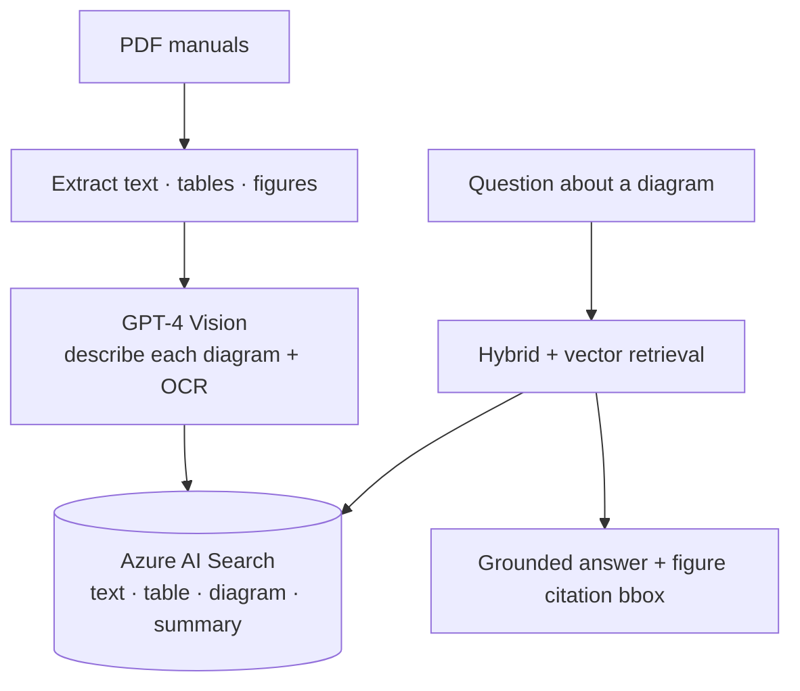

# Vision RAG Pipeline — GPT-4V Diagram Q# MANGOS Vision RAG — Ask Questions About DiagramsA

> Multimodal RAG that answers questions about **diagrams, schematics, charts, and tables** — not just body text. Figures are described by GPT‑4 Vision and made first-class, citable, retrievable records.

   


---

## Why this exists

The most valuable content in technical documents is visual — a wiring diagram, an exploded parts view, a P&ID. Plain-text RAG silently drops it. This pipeline captions every figure with GPT‑4 Vision (plus OCR) and indexes it, so "what does the schematic on page 42 show?" returns a grounded, cited answer.

## Architecture



## Status
- **Implemented:** multimodal indexing pipeline (four record types incl. Vision-described diagrams), citation metadata with bounding boxes, reconciliation.
- **Focus / roadmap:** page-as-image retrieval (ColPali/ColQwen), a small demo UI that shows the cited figure inline, an eval set of diagram questions.

## Quickstart
```bash
pip install -r requirements.txt
cp deploy.config.example.json deploy.config.json   # commercial-Azure values
python scripts/run_pipeline.py
```

---
